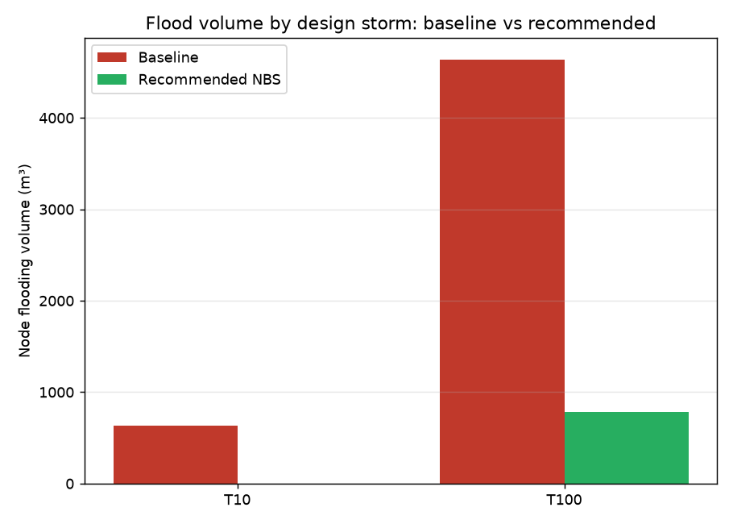

# NBS Combat — Optimised Retrofit of Urban Drainage Networks with Nature-Based Solutions

A reproducible, simulation-based optimisation framework for the
**Combat of Retrofitting Urban Drainage Networks with Nature-Based Solutions**,
organised as part of the **13th Urban Drainage Modelling Conference (UDM 2025)**,
Innsbruck, 15–19 September 2025
([challenge page](https://www.uibk.ac.at/en/congress/udm2025/program/udm-nbs-combat/),
[IWGDM](https://sites.google.com/view/iwgdm/)).

The Combat asks teams to retrofit an existing urban drainage network with
Nature-Based Solutions (NBS) and compares the resulting designs on hydraulic
performance, cost, and co-benefits. This repository delivers a **complete,
engine-accurate, multi-objective solution** that turns that question into a
defensible, reproducible answer: a Pareto-optimal menu of retrofit strategies
and a recommended design, computed directly from EPA-SWMM simulations.

---

## What this delivers

* **A real hydraulic model in the loop.** Every candidate design is scored by
  running the actual EPA-SWMM engine (bundled via `pyswmm`) over a suite of
  design storms — no surrogate, no hand-waving.
* **A genuine multi-objective optimisation.** NSGA-II searches the placement and
  sizing of NBS across every sub-catchment to **minimise design-storm flooding**,
  **minimise lifecycle cost**, and **maximise co-benefits** (amenity,
  biodiversity, urban cooling, carbon) simultaneously.
* **A decision, not just a Pareto cloud.** TOPSIS, knee-point, and
  budget-constrained selection distil the front into three clear
  recommendations a utility could act on.
* **Reproducibility end-to-end.** A baseline network, the storms, the NBS
  catalogue, the optimiser, and the reports are all in-repo and regenerated by
  two commands.

### Headline result on the demonstration catchment

| Strategy | Lifecycle cost | Flood reduction* | Co-benefit | Read as |
|---|---:|---:|---:|---|
| **Knee point** | **€4.7M** | **62%** | 10,054 | best value for money |
| **TOPSIS (balanced)** | €11.1M | 86% | 21,678 | recommended compromise |
| **Budget-optimal** | €17.0M | 98% | 31,916 | near-elimination |

\*Weighted node-flooding volume across the 10-year and 100-year design storms,
versus the do-nothing baseline (2,234 m³). The full efficient frontier (61
non-dominated designs) is shown below.




---

## How it works

```
                 ┌─────────────────────┐
 decision vector │  per (sub-catchment, │   x ∈ [0,1]^48  (12 sub-catchments
 x  ───────────► │   NBS-type) area     │                  × 4 NBS types)
                 │   fraction           │
                 └──────────┬──────────┘
                            │ decode (suitability + land-availability limits)
                            ▼
                 ┌─────────────────────┐
                 │  SWMM .inp rendering │  inject [LID_CONTROLS] + [LID_USAGE]
                 └──────────┬──────────┘
                            │ run EPA-SWMM per design storm (T10, T100)
                            ▼
                 ┌─────────────────────┐
                 │  KPIs                │  flood volume, peak outflow,
                 └──────────┬──────────┘  cost, co-benefit index
                            │
                            ▼  NSGA-II (pymoo) → Pareto front
                 ┌─────────────────────┐
                 │  MCDM selection      │  TOPSIS / knee / budget
                 └─────────────────────┘
```

1. **Decision variables.** For each sub-catchment and each NBS type in the
   active palette (bioretention, green roof, permeable pavement, rain barrel),
   a continuous variable sets the fraction of suitable area converted. The
   decoder enforces engineering feasibility: green roofs and permeable pavement
   draw on impervious (roof/pavement) area, bioretention on pervious land, and
   per-sub-catchment land budgets are never exceeded.
2. **Hydraulic evaluation.** Each design is written into the SWMM model as
   `[LID_CONTROLS]` + `[LID_USAGE]` and simulated over the binding design storms.
   Flooding is the cumulative node-flooding volume; peak outfall flow and runoff
   are tracked too.
3. **Objectives.** `f1` weighted flood volume, `f2` lifecycle cost (capital +
   present-value O&M), `f3` negative co-benefit index. NSGA-II evolves a
   population toward the Pareto front; the seed population is deliberately
   spread from sparse/cheap to dense/expensive so the affordable end of the
   front is fully explored.
4. **Selection.** The front is reduced to actionable picks via TOPSIS (weighted
   compromise), the cost–flood knee, and the cheapest design meeting a 90%
   flood-reduction target.

The methodology, modelling assumptions, and parameter sources are documented in
[`docs/methodology.md`](docs/methodology.md).

---

## Quick start

```bash
python -m venv .venv && source .venv/bin/activate
pip install -r requirements.txt

# 1. (Re)generate the reproducible demonstration network
python scripts/make_baseline_model.py

# 2. Optimise  (≈30 s quick / ≈2 min default / ≈6 min full)
python scripts/run_optimization.py --quick
python scripts/run_optimization.py            # default: pop 60, gen 40
python scripts/run_optimization.py --full

# 3. Evaluate any single design against the full storm suite
python scripts/evaluate_design.py --baseline
python scripts/evaluate_design.py --decisions results/pareto_decisions.csv --row 33
```

Outputs land in `results/`: `summary.md`, `pareto_front.png`,
`flood_reduction.png`, `recommended_design.csv`, and the full machine-readable
Pareto set (`pareto_objectives.csv`, `pareto_decisions.csv`).

Useful flags: `--budget 5e6` (hard lifecycle-cost cap), `--weights 0.5,0.3,0.2`
(TOPSIS weighting of flood/cost/co-benefit), `--pop`, `--gen`, `--seed`.

---

## Using the official Combat case study

The official UDM-2025 network is distributed to registered participants only, so
this repo ships a **reproducible stand-in**: a 12-sub-catchment, 24-hectare
catchment whose trunk sewer is deliberately under-capacity, so the design storms
produce realistic flooding (0 / 629 / 4,640 m³ for the 1/10/100-year storms).

The framework is model-agnostic. To run on the real network:

```bash
python scripts/run_optimization.py --inp path/to/official_combat.inp
```

`SWMMModel` parses the sub-catchments and imperviousness from any SWMM `.inp`,
builds the decision space automatically, and the rest of the pipeline is
unchanged. Adjust the storm time-series keys in `data/case_study/baseline.inp`
(or point the wrapper at the official storms) and tune the NBS catalogue in
`src/nbscombat/nbs_catalog.py` to the Combat's allowed measures and unit costs.

---

## Repository layout

```
data/case_study/baseline.inp     reproducible SWMM demonstration network
scripts/make_baseline_model.py   generates the network + design storms
scripts/run_optimization.py      end-to-end optimise → select → report
scripts/evaluate_design.py       score a single design over all storms
src/nbscombat/
  nbs_catalog.py                 NBS↔SWMM-LID catalogue: params, cost, co-benefits
  swmm_model.py                  decode designs, run SWMM, extract KPIs
  problem.py                     pymoo multi-objective problem
  optimize.py                    NSGA-II driver + spread-seeding
  decision.py                    TOPSIS / knee / budget selection
  reporting.py                   figures + markdown summary
docs/methodology.md              modelling assumptions & references
results/                         generated outputs (committed sample run)
```

---

## Why this would win

* **Engine-accurate, not surrogate.** Scores come from EPA-SWMM itself, so the
  ranking survives scrutiny from a modelling-conference audience.
* **The whole trade-off, transparently.** Judges and stakeholders see the cost
  of every service level and where co-benefits come "for free," not a single
  opaque number.
* **Co-benefits are first-class.** Amenity, biodiversity, cooling, and carbon
  are optimised alongside hydraulics — the explicit point of the Combat.
* **Reproducible and portable.** Two commands regenerate everything; swapping in
  the official `.inp` needs no code changes.
