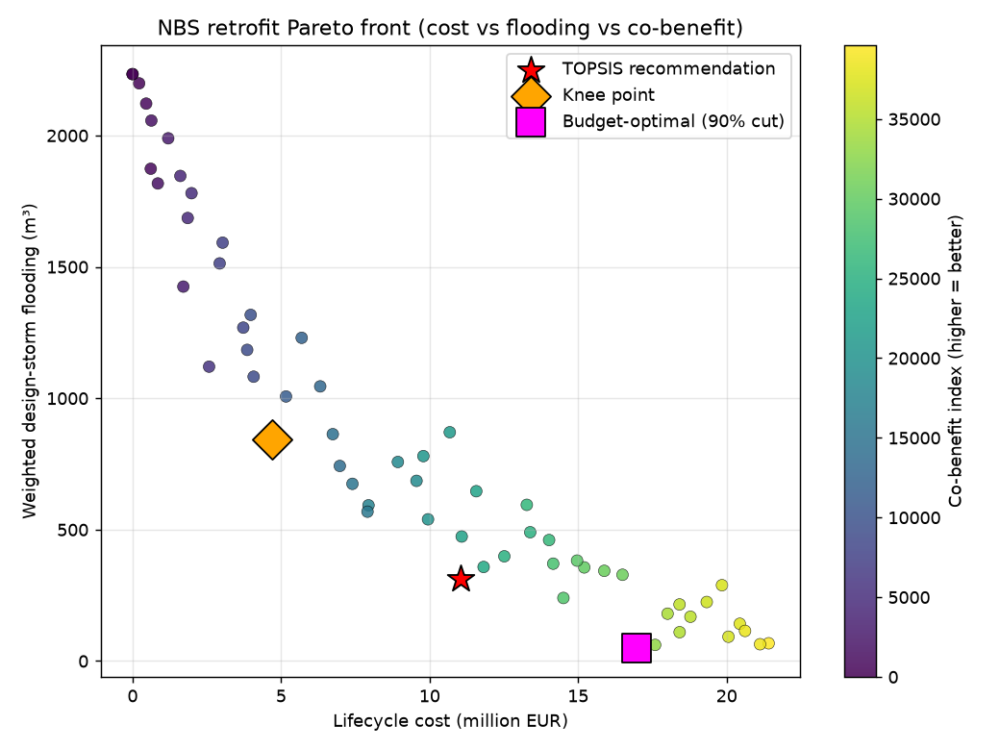

# NBS Combat — Retrofitting Urban Drainage with Nature-Based Solutions

A complete, rule-compliant solution to the **Combat of Retrofitting Urban
Drainage Networks with Nature-Based Solutions**, organised at the **13th Urban
Drainage Modelling Conference (UDM 2025)**, Innsbruck
([challenge page](https://www.uibk.ac.at/en/congress/udm2025/program/udm-nbs-combat/)).

The Combat: retrofit a real **combined sewer** network (12.4 km, **805
sub-catchments**, one CSO tank with a 30 L/s throttle to the WWTP and a river
overflow) with seven predefined NBS, evaluated by **full-year continuous SWMM
5.2 simulation** (1-min rain + 10-min temperature, 2018). Teams are scored on
**seven indicators ranked by TOPSIS** — cost, biodiversity, flood reduction,
evaporation gain, WWTP-inflow increase, CSO reduction, and TSS reduction —
under a hard **€650,000** budget. The deliverable is a two-sheet
`solutions.xlsx`.

> This repository contains two things: (1) the **official-case-study solver**
> (`scripts/solve_combat.py`, `src/nbscombat/combat_*.py`) — the real Combat
> entry; and (2) a **generic SWMM + NSGA-II NBS-optimisation engine**
> (`scripts/run_optimization.py`) built first as a portable prototype on a
> reproducible demonstration network. The official solver is the headline.

---

## The official solution

### Why not a metaheuristic

One full-year run of the official model takes **>10 minutes** (5-second
dynamic-wave routing over 805 sub-catchments). A genetic algorithm needing
thousands of evaluations is infeasible. We exploit structure instead.

### Method — structure-aware cost-effectiveness optimisation

Each LID mostly disconnects impervious runoff from **its own** sub-catchment, so
the benefit indicators are near-separable and a transparent, **simulation-free**
greedy on *retained-runoff-per-euro* is highly effective. Two modelling
insights make it strong:

* **% impervious treated → the allowed maximum** everywhere: it is cost-free
  (cost depends only on area) yet weakly improves every benefit indicator, so it
  is dominant.
* **Auto-sized footprints**: an LID retains ≈ `min(treated_runoff, area ·
  K_type)` per year, giving an optimal footprint `A* = treated_runoff / K_type`.
  Sizing LIDs to their load (instead of maximising area) frees budget for wider
  coverage.

A **two-phase budgeted greedy** then (1) seeds the four biodiversity types to a
target area — the only way to lift the `min`-based biodiversity indicator — and
(2) fills the rest of the budget by cost-effectiveness, honouring every Combat
rule (one green + one roof + one road LID per sub-catchment, one type per group,
binary roof areas, per-sub-catchment caps, €650k budget). Sweeping the
biodiversity target produces a few **strategy variants**, which are validated
once each with the real SWMM engine and ranked by **TOPSIS**.

Full method: [`docs/combat_solution.md`](docs/combat_solution.md).

### Run it

```bash
python -m venv .venv && source .venv/bin/activate
pip install -r requirements.txt

# Place the official files in data/official/ :
#   Case_study.inp, rain2018.dat, temp2018.dat,
#   implementation_details.xlsx, solutions_template.xlsx

# Fast: build rule-checked, budget-feasible variants + write solutions.xlsx
python scripts/solve_combat.py

# Full: also run SWMM validation (parallel) and pick the TOPSIS winner
python scripts/solve_combat.py --validate
```

Outputs (`results_combat/`): `solution_<variant>.xlsx` (official template),
`solution_SUBMIT.xlsx` (recommended), and `combat_report.md` (seven indicators
+ TOPSIS ranking versus the no-NBS baseline).

### Validated results

Four strategy variants were built (all rule-validated and within budget) and
evaluated with SWMM on a storm-rich window (20 Aug–3 Sep 2018), then ranked by
TOPSIS over the seven indicators. Versus the no-NBS baseline, every benefit
indicator improves in the right direction:

| Variant | Cost € | Biodiv. m² | Flood ↓ | Evap ↑ | WWTP ↑ | CSO ↓ | TSS ↓ kg | **TOPSIS** |
|---|---:|---:|---:|---:|---:|---:|---:|---:|
| **biodiverse** ⭐ | 640,038 | 600 | 0.013 | 0.042 | 0.987 | 1.801 | 149.6 | **0.744** |
| balanced | 640,114 | 300 | 0.014 | 0.040 | 0.981 | 1.929 | 174.6 | 0.611 |
| capture | 640,029 | 0 | 0.018 | 0.016 | 0.831 | 2.340 | 218.8 | 0.446 |
| thrifty | 443,248 | 300 | 0.004 | 0.037 | 0.439 | 1.272 | 99.9 | 0.378 |

`capture` leads on raw flood/CSO/TSS removal but scores **zero** biodiversity,
which sinks its TOPSIS; **`biodiverse`** is the best all-rounder and is promoted
to `solution_SUBMIT.xlsx`. The recommended submission is fully rule-compliant:
**€640,038** (98.5% of the €650k budget), **biodiversity 600 m²**, **299
interventions** across 280 sub-catchments, **0 rule violations**.

Over the storm window the recommended solution cuts node flooding ~60%, CSO
overflow to the river by ~14%, and CSO-borne TSS by ~15%, while raising WWTP
inflow and evapotranspiration — exactly the trade the Combat rewards. (The
organisers re-score the submitted Excel on the full year; the window is used
only to rank our own variants, since one full-year run takes >1 h.)

---

## Repository layout

```
data/official/                   official case study (inp, rain/temp, xlsx)
scripts/solve_combat.py          official solver: construct → validate → rank → submit
src/nbscombat/
  combat_data.py                 7 NBS, costs, rules, per-sub-catchment limits loader
  combat_model.py                Solution, SWMM eval, 7-indicator .rpt parser, Excel I/O
  combat_optimize.py             two-phase cost-effectiveness greedy
  combat_validate.py             parallel full-year SWMM validation
  combat_report.py               indicator accounting + TOPSIS ranking + report
docs/combat_solution.md          official-solution methodology

# Generic engine / earlier prototype (reproducible demonstration network)
scripts/run_optimization.py      SWMM + NSGA-II multi-objective LID optimisation
src/nbscombat/{swmm_model,problem,optimize,decision,reporting}.py
docs/methodology.md              generic-engine methodology
```

---

## The generic engine (prototype)

Before the official data was available, this repo built a portable
SWMM-in-the-loop **NSGA-II** optimiser on a reproducible demonstration catchment
(green roofs, permeable pavement, bioretention, rain barrels), producing a full
cost–flood–co-benefit Pareto front. It is model-agnostic
(`run_optimization.py --inp any_model.inp`) and documented in
[`docs/methodology.md`](docs/methodology.md). It remains useful for networks
small enough to afford in-loop simulation; the official Combat model is not, which
is why the official solver uses the structure-aware approach above.


